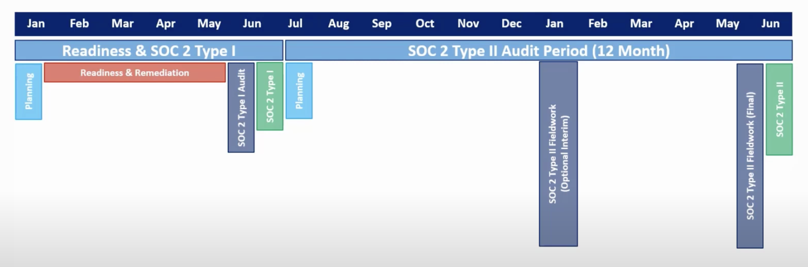
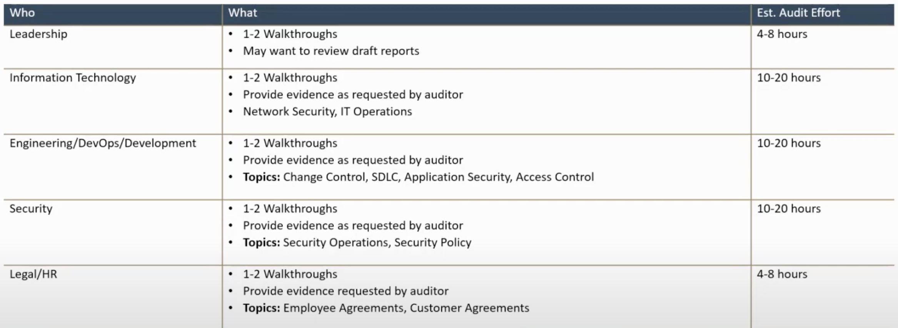

# 5 parts
Must have is **Security**, others are optional: 
- Confidentiality
- Availability
- Process Integration
- Privacy

# There are two types:
- **Type 1:** At some point in time
- **Type 2:** Over the period of a 6M to a Year. **NOTE** This is something that has to be done year over year, so it has expiration date...

Usually, one starts with Type 1 and then continues with Type 2 (most companies will ask for Type 2)

# How long it takes?
- Type 1: 3M to 6M
- Type 2: 6M to a year

# There are no hard rules
- It's not a specification that you must meet
- You work with a firm that has ability to issue the SOC 2 report.
- Idea is not to enforce some specific rules, but more to improve and report what is already there.

# Timeline

- Type2 period can wary, usually it's 12M, it can be also 3M at minimum or 6M.
- It's recommended to do at last 6M, but if forced 3M can be ok.

# Efforts

- Compliance company provides a platform where asks and exchange of evidence happens - no need to hire anyone additionally.
- Using cloud providers makes stuff a lot easier
- If all working remote also a lot easier (no need for visitor logs, badges etc)
- We are all vendors?
- 10-80k per year...

# What is soc2?
- SOC 2 is a reporting framework and NOT a security framework, meaning it aims to enhance security by requiring an independent audit, it is primarily focused on reporting rather than prescribing a one-size-fits-all set of security controls.

# Summary
- Pick a firm that will issue a report.
- Let them do evaluation and and tell you what to do.
- Do only things asked.